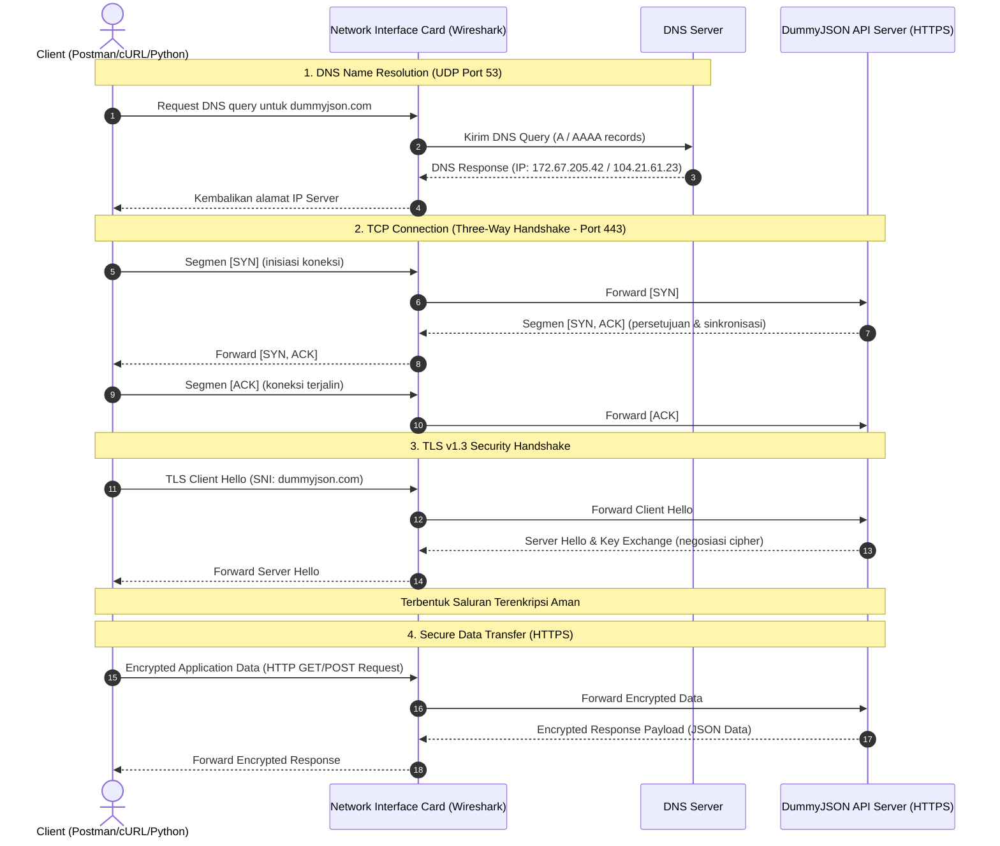

# 🌐 Analisis Protokol Komunikasi & Data Serialization — Kelompok 04

Dokumentasi ini disusun untuk memenuhi tugas **Ujian Tengah Semester (UTS) Kelompok** pada mata kuliah **Communication Protocol** (Semester 2 - Program Studi Sains Data - Kelas Reguler). 

Proyek ini berfokus pada **REST API JSON (Case A)**, mencakup pengujian API request (GET/POST), analisis packet capture Wireshark, pemetaan data serialization, pembuatan parsing script otomatis menggunakan Python, serta dokumentasi terintegrasi.

---

## 👥 Profil Kelompok & Pembagian Peran

Setiap anggota memiliki peran dan tanggung jawab spesifik yang saling terintegrasi dalam penyelesaian proyek:

| Foto/Visual | Nama & NIM | Peran Utama | Tanggung Jawab & Kontribusi | Evidence Link |
| :---: | :--- | :--- | :--- | :--- |
| 🧑‍💻 | **Fathur Rijal**<br>`25110500002` | **Role 1: API Tester & Postman Collection** | - Menyiapkan skenario request GET & POST.<br>- Mengonfigurasi parameter, header, body, dan environment.<br>- Mendokumentasikan request/response API. | 📂 [collection.json](file:///c:/Users/bevan/Downloads/UTS-Communication-Protocol-Kelompok-04/postman/collection.json)<br>📂 [curl_commands.txt](file:///c:/Users/bevan/Downloads/UTS-Communication-Protocol-Kelompok-04/curl/curl_commands.txt)<br>📄 [Refleksi Fathur](file:///c:/Users/bevan/Downloads/UTS-Communication-Protocol-Kelompok-04/reflection/reflection_fathur_rijal.pdf) |
| 🛡️ | **Muhammad Bevan Alqarana**<br>`25110500020` | **Role 2: Packet Capture & Troubleshooting** | - Melakukan sniffing traffic jaringan saat request dikirim.<br>- Menganalisis log jaringan (DNS, TCP Handshake, TLS).<br>- Melakukan filter Wireshark dan debugging. | 📂 [traffic_capture.pcapng](file:///c:/Users/bevan/Downloads/UTS-Communication-Protocol-Kelompok-04/capture/traffic_capture.pcapng)<br>📄 [Refleksi Bevan](file:///c:/Users/bevan/Downloads/UTS-Communication-Protocol-Kelompok-04/reflection/reflection_muhammad_bevan_alqarana.pdf) |
| 🐍 | **Alya Mutiara Lattifa**<br>`25110500019` | **Role 3: Data Analysis & Python Parsing** | - Menganalisis skema respons JSON.<br>- Merancang python script dengan ekstraksi aman (`.get()`).<br>- Mengonversi payload menjadi tabular DataFrame dan CSV. | 📂 [parsing_script.py](file:///c:/Users/bevan/Downloads/UTS-Communication-Protocol-Kelompok-04/python/parsing_script.py)<br>📂 [parsed_result.csv](file:///c:/Users/bevan/Downloads/UTS-Communication-Protocol-Kelompok-04/output/parsed_result.csv)<br>📄 [Refleksi Alya](file:///c:/Users/bevan/Downloads/UTS-Communication-Protocol-Kelompok-04/reflection/reflection_alya_mutiara_lattifa.pdf) |
| 📊 | **Tiara Putri Ramadhani**<br>`25110500004` | **Role 4: Repository Structure & Reporter** | - Menyusun struktur folder proyek standar.<br>- Mengompilasi dan memvalidasi evidence.<br>- Menyusun laporan PDF akhir dan presentasi PPT. | 📂 [presentation_uts.pdf](file:///c:/Users/bevan/Downloads/UTS-Communication-Protocol-Kelompok-04/ppt/presentation_uts_kelompok.pdf)<br>📂 [report_uts.pdf](file:///c:/Users/bevan/Downloads/UTS-Communication-Protocol-Kelompok-04/report/report_uts_kelompok.pdf)<br>📄 [Refleksi Tiara](file:///c:/Users/bevan/Downloads/UTS-Communication-Protocol-Kelompok-04/reflection/reflection_tiara_putri_ramadhani.pdf) |

---

## 📐 Arsitektur & Alur Request Jaringan

Bagan sequence diagram di bawah ini mengilustrasikan alur komunikasi protokol dari client hingga ke server API, serta posisi pengambilan data (*capture point*):



---

## 🛠️ Dokumentasi Teknis Hasil Pengujian (Evidence-based)

### 1. API Testing (Role 1)
Pengujian API dilakukan terhadap server publik `https://dummyjson.com` menggunakan Postman dan cURL. Terdapat total **5 skenario pengujian** (2 GET dan 3 POST):

> [!NOTE]
> Semua pengujian menggunakan variabel `{{baseUrl}}` yang merujuk pada `https://dummyjson.com`.

| Skenario | Method | Endpoint | Status Code | Deskripsi & Tujuan | Target Payload / Response |
| :--- | :---: | :--- | :---: | :--- | :--- |
| **Pengujian 1** | `GET` | `{{baseUrl}}/products/?limit=5&skip=0` | `200 OK` | Mengambil data katalog produk secara massal dengan batasan 5 item untuk efisiensi jaringan. | Memuat array berisi 5 objek produk beserta metadatanya. |
| **Pengujian 2** | `GET` | `{{baseUrl}}/products/2` | `200 OK` | Mengakses detail spesifik untuk produk ID 2 (*Eyeshadow Palette with Mirror*). | Objek produk tunggal dengan deskripsi, harga, SKU, dan tags. |
| **Pengujian 3** | `POST` | `{{baseUrl}}/products/add` | `201 Created` | Mensimulasikan pendaftaran data produk baru ke dalam database server. | Kembalian berupa objek produk baru yang berhasil dibuat beserta ID unik baru. |
| **Pengujian 4** | `POST` | `{{baseUrl}}/auth/login` | `400 Bad Request` | Uji coba autentikasi dengan mengirim bodi kosong untuk validasi keamanan server. | Respons error: `{"message": "Username and password required"}`. |
| **Pengujian 5** | `POST` | `{{baseUrl}}/auth/login` | `200 OK` | Autentikasi dengan kredensial valid (`emilys` / `emilyspass`) untuk memperoleh token akses. | Mengembalikan `accessToken`, `refreshToken`, data user, dan hak akses. |

> [!TIP]
> Detail lengkap cURL command siap-pakai dapat diakses di file [curl_commands.txt](file:///c:/Users/bevan/Downloads/UTS-Communication-Protocol-Kelompok-04/curl/curl_commands.txt).

---

### 2. Analisis Jaringan & Packet Capture (Role 2)
Proses capture traffic menggunakan Wireshark menghasilkan file rekaman [traffic_capture.pcapng](file:///c:/Users/bevan/Downloads/UTS-Communication-Protocol-Kelompok-04/capture/traffic_capture.pcapng) dengan rincian analisis sebagai berikut:

*   **DNS Resolution (UDP Port 53)**:
    *   Query: `Standard query 0x245c AAAA dummyjson.com`
    *   Response: Mengembalikan alamat IP server CDN Cloudflare: `172.67.205.42` dan `104.21.61.23`.
*   **TCP Handshake (Port 443)**:
    *   Membangun sesi transport stateful sebelum transmisi data.
    *   Terlihat jelas alur pengiriman flag bit `SYN` ➔ `SYN, ACK` ➔ `ACK`.
*   **TLS v1.3 Handshake**:
    *   Terjadi pertukaran kunci kriptografi (*Key Exchange*) dan enkripsi saluran.
    *   Parameter SNI (*Server Name Indication*) terbaca jelas sebagai `dummyjson.com` pada paket *Client Hello*.
*   **Encrypted Application Data**:
    *   Karena menggunakan HTTPS, muatan payload JSON yang dikirimkan terenkripsi di dalam paket TLS Application Data, sehingga kebal terhadap inspeksi langsung (*sniffing*) di level transport.

#### 🔍 Wireshark Filter yang Digunakan:
```wireshark
# Menampilkan paket terkait DNS query/response untuk dummyjson
dns.qry.name contains "dummyjson"

# Menampilkan proses jabat tangan TLS spesifik ke server tujuan
tls.handshake.extensions_server_name contains "dummyjson"

# Menyaring seluruh paket IP yang mengarah ke endpoint API kelompok
ip.addr == 172.67.205.42 || ip.addr == 104.21.61.23
```

---

### 3. Analisis Format Data & Python Parser (Role 3)

#### 📝 Analisis Skema JSON (Data Serialization)
Data yang dipertukarkan berupa JSON Object yang diawali kurung kurawal `{}` dengan tipe data yang variatif:
*   `id`, `stock`: **Integer** (contoh: `2`, `34`)
*   `title`, `sku`, `category`: **String** (contoh: `"Eyeshadow Palette..."`, `"BEA-GLA-EYE-002"`)
*   `price`, `discountPercentage`: **Float/Decimal** (contoh: `19.99`, `18.19`)
*   `tags`: **Array/List** (contoh: `["beauty", "eyeshadow"]`)

#### 🐍 Python Script untuk Parsing Aman (`python/parsing_script.py`)
Skrip dirancang menggunakan pustaka `requests` untuk pemanggilan API dan `pandas` untuk transformasi data terstruktur. Skrip mengimplementasikan **safe data extraction** melalui fungsi `.get()` untuk menghindari crash akibat `KeyError` apabila struktur JSON berubah sewaktu-waktu.

```python
# Potongan skrip ekstraksi aman (parsing_script.py)
prod_id = data.get("id", "N/A")
title   = data.get("title", "N/A")
price   = data.get("price", "N/A")
sku     = data.get("sku", "N/A")
stock   = data.get("stock", "N/A")
tags    = data.get("tags", [])
```

#### 📊 Output Tabular DataFrame & CSV
Setelah di-parsing, program mengekspor DataFrame ke file [parsed_result.csv](file:///c:/Users/bevan/Downloads/UTS-Communication-Protocol-Kelompok-04/output/parsed_result.csv) dengan struktur data sebagai berikut:

| id | name | value |
| :---: | :--- | :---: |
| 2 | Eyeshadow Palette with Mirror | 19.99 |

---

## 📁 Struktur Repositori Proyek

Struktur folder dikelola secara rapi dan sistematis agar dosen/pemeriksa dapat mereplikasi seluruh tahapan pengujian dengan mudah:

```text
/UTS-Communication-Protocol-Kelompok-04
│
├── 📝 README.md                              <- Dokumentasi utama proyek (file ini)
│
├── 📁 postman/
│   └── 📂 collection.json                     <- File export collection Postman
│
├── 📁 curl/
│   └── 📄 curl_commands.txt                  <- Kumpulan command cURL terdokumentasi
│
├── 📁 capture/
│   └── 📊 traffic_capture.pcapng              <- Hasil rekaman packet capture Wireshark
│
├── 📁 python/
│   └── 🐍 parsing_script.py                  <- Skrip Python untuk parsing JSON & export CSV
│
├── 📁 output/
│   └── 📊 parsed_result.csv                   <- Hasil konversi data parsing ke tabular CSV
│
├── 📁 screenshots/
│   ├── 📁 request_response/                  <- Bukti screenshot pengujian 1 s.d 5 di Postman
│   │   ├── pengujian1_role1.png
│   │   ├── pengujian2_role1.png
│   │   ├── pengujian3_role1.png
│   │   ├── pengujian4_role1.png
│   │   └── pengujian5_role1.png
│   └── 📁 packet_analysis/                   <- Bukti screenshot analisis paket Wireshark
│       └── packet_analysis.png
│
├── 📁 report/
│   └── 📕 report_uts_kelompok.pdf            <- Laporan Utama UTS (.pdf)
│
├── 📁 ppt/
│   └── 📙 presentation_uts_kelompok.pdf       <- File PPT Presentasi UTS (.pdf/.pptx)
│
└── 📁 reflection/
    ├── 📄 reflection_alya_mutiara_lattifa.pdf
    ├── 📄 reflection_fathur_rijal.pdf
    ├── 📄 reflection_muhammad_bevan_alqarana.pdf
    └── 📄 reflection_tiara_putri_ramadhani.pdf
```

---

## 🛠️ Cara Mereplikasi Proyek Secara Mandiri

Ikuti langkah-langkah di bawah ini untuk menjalankan ulang pengujian pada komputer Anda:

### 1. Uji Coba API
*   **Melalui Postman**: Import file [collection.json](file:///c:/Users/bevan/Downloads/UTS-Communication-Protocol-Kelompok-04/postman/collection.json). Konfigurasi environment variable `baseUrl` ke `https://dummyjson.com`. Klik Send pada tiap request.
*   **Melalui cURL**: Buka terminal dan salin baris perintah yang ada pada dokumen [curl_commands.txt](file:///c:/Users/bevan/Downloads/UTS-Communication-Protocol-Kelompok-04/curl/curl_commands.txt) lalu jalankan.

### 2. Membuka File Packet Capture
1.  Pastikan aplikasi **Wireshark** sudah terinstall di komputer Anda.
2.  Buka file [traffic_capture.pcapng](file:///c:/Users/bevan/Downloads/UTS-Communication-Protocol-Kelompok-04/capture/traffic_capture.pcapng) dengan Wireshark.
3.  Gunakan filter `ip.addr == 172.67.205.42` untuk menyaring traffic ke server DummyJSON.

### 3. Menjalankan Skrip Python (Parsing)
1.  Pastikan Anda telah menginstal pustaka dependensi (`requests` dan `pandas`):
    ```bash
    pip install requests pandas
    ```
2.  Jalankan skrip python melalui terminal:
    ```bash
    python python/parsing_script.py
    ```
3.  Skrip akan menampilkan visualisasi DataFrame di terminal dan memperbarui file [parsed_result.csv](file:///c:/Users/bevan/Downloads/UTS-Communication-Protocol-Kelompok-04/output/parsed_result.csv) secara otomatis.

---

## 💡 Pelajaran Berharga & Insight Proyek

1.  **Enkripsi vs Inspeksi**: Penggunaan protokol HTTPS (TLS v1.3) sukses melindungi integritas data pengguna. Namun, enkripsi ini membatasi visibilitas inspeksi payload di level transport (Wireshark), sehingga analisis muatan data harus didelegasikan ke tingkat aplikasi menggunakan bahasa pemrograman (Python) atau client API (Postman).
2.  **Robust Programming**: Format data JSON bersifat semi-terstruktur dan rentan terhadap modifikasi skema dari server. Penggunaan metode pertahanan seperti `.get()` dalam script Python merupakan langkah mitigasi wajib untuk meminimalkan potensi kegagalan sistem terdistribusi.
3.  **Protokol Bertingkat**: Keberhasilan satu API call sederhana melibatkan serangkaian protokol kolaboratif: DNS (penerjemahan alamat), TCP (jaminan pengiriman handal melalui Three-way Handshake), TLS (keamanan sandi), dan HTTP/REST (pembawa muatan aplikasi).
