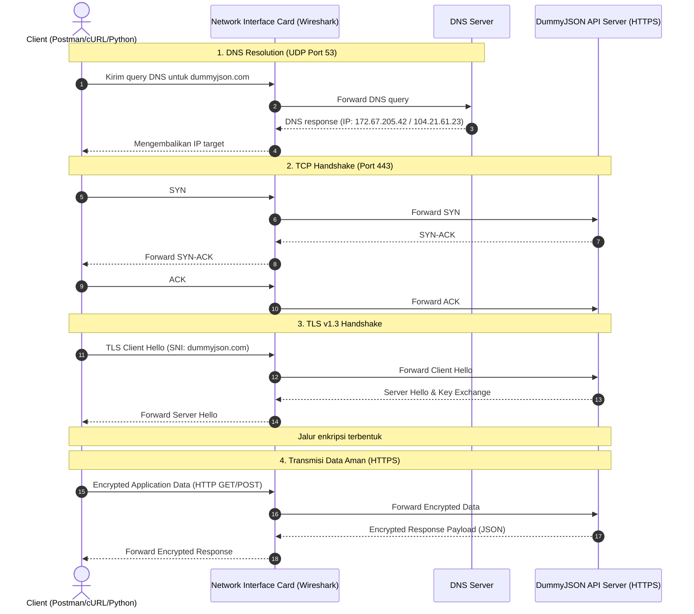

# UTS Communication Protocol - Kelompok 04

Repositori ini berisi berkas dan dokumentasi untuk Ujian Tengah Semester (UTS) mata kuliah Communication Protocol, program studi Sains Data (Semester 2, Kelas Reguler). Studi kasus yang dipilih adalah **Case A - REST API JSON**. Proyek ini mencakup pengujian API request, analisis lalu lintas jaringan (packet capture), pemetaan skema serialisasi data, dan pembuatan skrip parser otomatis menggunakan Python.

---

## Anggota Kelompok dan Pembagian Peran

Berikut adalah daftar anggota Kelompok 04 beserta peran dan berkas kontribusi masing-masing:

| Nama | NIM | Peran Utama | Berkas Kontribusi |
| :--- | :--- | :--- | :--- |
| **Fathur Rijal** | 25110500002 | Role 1: API Tester & Postman Collection | [collection.json](file:///c:/Users/bevan/Downloads/UTS-Communication-Protocol-Kelompok-04/postman/collection.json)<br>[curl_commands.txt](file:///c:/Users/bevan/Downloads/UTS-Communication-Protocol-Kelompok-04/curl/curl_commands.txt)<br>[Refleksi Fathur](file:///c:/Users/bevan/Downloads/UTS-Communication-Protocol-Kelompok-04/reflection/reflection_fathur_rijal.pdf) |
| **Muhammad Bevan Alqarana** | 25110500020 | Role 2: Packet Capture & Troubleshooting | [traffic_capture.pcapng](file:///c:/Users/bevan/Downloads/UTS-Communication-Protocol-Kelompok-04/capture/traffic_capture.pcapng)<br>[Refleksi Bevan](file:///c:/Users/bevan/Downloads/UTS-Communication-Protocol-Kelompok-04/reflection/reflection_muhammad_bevan_alqarana.pdf) |
| **Alya Mutiara Lattifa** | 25110500019 | Role 3: Data Analysis & Python Parsing | [parsing_script.py](file:///c:/Users/bevan/Downloads/UTS-Communication-Protocol-Kelompok-04/python/parsing_script.py)<br>[parsed_result.csv](file:///c:/Users/bevan/Downloads/UTS-Communication-Protocol-Kelompok-04/output/parsed_result.csv)<br>[Refleksi Alya](file:///c:/Users/bevan/Downloads/UTS-Communication-Protocol-Kelompok-04/reflection/reflection_alya_mutiara_lattifa.pdf) |
| **Tiara Putri Ramadhani** | 25110500004 | Role 4: Repository Structure & PPT/Report | [presentation_uts.pdf](file:///c:/Users/bevan/Downloads/UTS-Communication-Protocol-Kelompok-04/ppt/presentation_uts_kelompok.pdf)<br>[report_uts.pdf](file:///c:/Users/bevan/Downloads/UTS-Communication-Protocol-Kelompok-04/report/report_uts_kelompok.pdf)<br>[Refleksi Tiara](file:///c:/Users/bevan/Downloads/UTS-Communication-Protocol-Kelompok-04/reflection/reflection_tiara_putri_ramadhani.pdf) |

---

## Alur Request dan Packet Capture

Diagram sekuensial berikut menunjukkan alur komunikasi antara client, Network Interface Card (capture point), DNS server, dan API server:



---

## Ringkasan Pengujian API (Role 1)

Pengujian dilakukan menggunakan Postman dan cURL terhadap endpoint API `https://dummyjson.com`.

| ID Pengujian | Method | Endpoint | Status Code | Deskripsi |
| :--- | :---: | :--- | :---: | :--- |
| Pengujian 1 | GET | `{{baseUrl}}/products/?limit=5&skip=0` | 200 OK | Mengambil katalog produk dengan batasan parameter limit=5. |
| Pengujian 2 | GET | `{{baseUrl}}/products/2` | 200 OK | Mengakses detail spesifik untuk produk ID 2. |
| Pengujian 3 | POST | `{{baseUrl}}/products/add` | 201 Created | Mengirimkan data produk baru dalam format JSON. |
| Pengujian 4 | POST | `{{baseUrl}}/auth/login` | 400 Bad Request | Pengujian validasi server dengan bodi request kosong. |
| Pengujian 5 | POST | `{{baseUrl}}/auth/login` | 200 OK | Login menggunakan kredensial valid (`emilys` / `emilyspass`) untuk memperoleh access token. |

Daftar perintah cURL untuk replikasi tersedia pada file [curl_commands.txt](file:///c:/Users/bevan/Downloads/UTS-Communication-Protocol-Kelompok-04/curl/curl_commands.txt).

---

## Analisis Jaringan (Role 2)

Proses perekaman lalu lintas jaringan yang disimpan di berkas [traffic_capture.pcapng](file:///c:/Users/bevan/Downloads/UTS-Communication-Protocol-Kelompok-04/capture/traffic_capture.pcapng) menunjukkan beberapa poin analisis:

1.  **Resolusi DNS**: Domain `dummyjson.com` diterjemahkan ke IP CDN Cloudflare (`172.67.205.42` dan `104.21.61.23`).
2.  **TCP Handshake**: Sesi dibangun pada port tujuan 443 melalui flag SYN, SYN-ACK, dan ACK.
3.  **TLS 1.3**: Negosiasi enkripsi dilakukan pada tahap handshake. Indikasi Server Name Indication (SNI) terbaca `dummyjson.com` pada paket Client Hello.
4.  **Payload Enkripsi**: Karena menggunakan HTTPS, payload JSON asli dienkripsi sebagai *TLS Application Data* dan tidak dapat dibaca langsung melalui Wireshark.

### Filter Wireshark yang Digunakan:
```wireshark
dns.qry.name contains "dummyjson"
tls.handshake.extensions_server_name contains "dummyjson"
ip.addr == 172.67.205.42 || ip.addr == 104.21.61.23
```

---

## Analisis Format Data dan Skrip Parser (Role 3)

### Skema Data JSON
Data yang dikirimkan menggunakan struktur JSON Object `{}` dengan tipe data sebagai berikut:
*   `id`, `stock`: **Integer**
*   `title`, `sku`: **String**
*   `price`: **Float/Decimal**
*   `tags`: **Array** (List of Strings)

### Skrip Python Parser
Skrip pada [parsing_script.py](file:///c:/Users/bevan/Downloads/UTS-Communication-Protocol-Kelompok-04/python/parsing_script.py) menggunakan library `requests` untuk HTTP GET request dan `pandas` untuk pemetaan ke bentuk tabel. Pengambilan data menggunakan fungsi `.get()` untuk menghindari *KeyError* apabila ada perubahan properti data dari server.

Hasil parsing DataFrame disimpan secara otomatis ke berkas CSV di [parsed_result.csv](file:///c:/Users/bevan/Downloads/UTS-Communication-Protocol-Kelompok-04/output/parsed_result.csv) dengan format:

```csv
id,name,value
2,Eyeshadow Palette with Mirror,19.99
```

---

## Struktur Repositori (Role 4)

Struktur repositori diatur sesuai ketentuan standar tugas praktikum:

```text
/UTS-Communication-Protocol-Kelompok-04
│
├── README.md                              <- Dokumentasi ini
│
├── postman/
│   └── collection.json                    <- Export Postman Collection
│
├── curl/
│   └── curl_commands.txt                  <- Kumpulan perintah cURL
│
├── capture/
│   └── traffic_capture.pcapng              <- Berkas Wireshark Packet Capture
│
├── python/
│   └── parsing_script.py                  <- Skrip parser Python
│
├── output/
│   └── parsed_result.csv                  <- Berkas luaran hasil parser (CSV)
│
├── screenshots/
│   ├── request_response/                  <- Screenshot pengujian 1-5 di Postman
│   │   ├── pengujian1_role1.png
│   │   ├── pengujian2_role1.png
│   │   ├── pengujian3_role1.png
│   │   ├── pengujian4_role1.png
│   │   └── pengujian5_role1.png
│   └── packet_analysis/                   <- Screenshot analisis paket di Wireshark
│       └── packet_analysis.png
│
├── report/
│   └── report_uts_kelompok.pdf            <- Laporan Utama UTS (PDF)
│
├── ppt/
│   └── presentation_uts_kelompok.pdf       <- Slide Presentasi (PDF)
│
└── reflection/
    ├── reflection_alya_mutiara_lattifa.pdf
    ├── reflection_fathur_rijal.pdf
    ├── reflection_muhammad_bevan_alqarana.pdf
    └── reflection_tiara_putri_ramadhani.pdf
```

---

## Cara Replikasi Pengujian

### 1. Eksekusi API Request
*   **Postman**: Import berkas [collection.json](file:///c:/Users/bevan/Downloads/UTS-Communication-Protocol-Kelompok-04/postman/collection.json) dan atur variabel environment `baseUrl` ke `https://dummyjson.com`.
*   **cURL**: Jalankan perintah-perintah pada berkas [curl_commands.txt](file:///c:/Users/bevan/Downloads/UTS-Communication-Protocol-Kelompok-04/curl/curl_commands.txt) melalui terminal.

### 2. Membuka Packet Capture
*   Buka berkas [traffic_capture.pcapng](file:///c:/Users/bevan/Downloads/UTS-Communication-Protocol-Kelompok-04/capture/traffic_capture.pcapng) menggunakan aplikasi Wireshark untuk melakukan analisis tingkat rendah.

### 3. Menjalankan Parser Python
1.  Instal library yang diperlukan:
    ```bash
    pip install requests pandas
    ```
2.  Jalankan skrip parser dari direktori root proyek:
    ```bash
    python python/parsing_script.py
    ```
3.  Hasil ekstraksi akan tercetak di terminal dan memperbarui berkas [parsed_result.csv](file:///c:/Users/bevan/Downloads/UTS-Communication-Protocol-Kelompok-04/output/parsed_result.csv).
